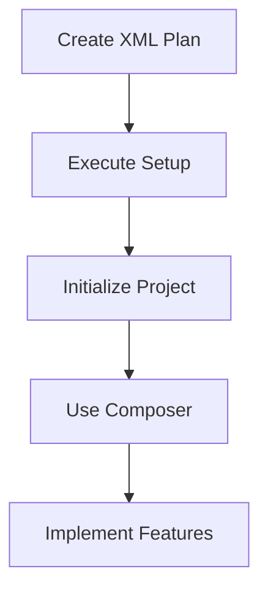
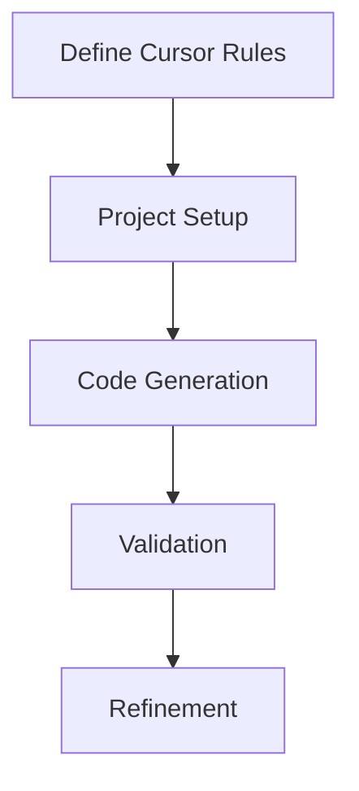

# Advanced Cursor AI Workflows

## XML-Formatted Planning

### 1. Plan Structure
```xml
<app_description>
  [Detailed app description including:
  - Features
  - Data structures
  - UI requirements
  - Environment details]
</app_description>

<instructions>
  [Specific instructions for file creation and organization]
</instructions>

<plan>
  <!-- Plan A: Setup Commands -->
  [NPX and NPM commands]
  
  <!-- Plan B: Implementation Details -->
  [Repeat of app description and instructions]
</plan>
```

### 2. Workflow Steps
1. **Initial Planning**
   ```typescript
   // Create structured plan
   const plan = {
     setup: ['npx commands', 'directory structure'],
     implementation: ['file creation', 'component logic']
   };
   ```

2. **Project Setup**
   - Use Plan A for initialization
   - Execute setup commands
   - Verify project structure

3. **Implementation**
   - Use Plan B with Composer
   - Create components and logic
   - Integrate features

## Cursor Rules Configuration

### 1. Basic Structure
```python
# .cursor-rules
"""
[System instructions for code generation]
Example: Always use TypeScript, follow project conventions
"""

# Language-specific rules
TYPESCRIPT_RULES = """
  - Use interfaces over types
  - Strict null checks
  - Explicit return types
"""

# Framework-specific rules
REACT_RULES = """
  - Functional components
  - Hooks pattern
  - Props typing
"""
```

### 2. Custom Rules Examples

#### TypeScript Application
```python
# .cursor-rules
"""
You are an expert in TypeScript, React, and modern web development.
Follow these conventions:
1. Use functional components
2. Implement proper type safety
3. Follow project structure
"""
```

#### Structured Output
```python
# .cursor-rules
"""
Use structured data patterns:
1. Implement Pydantic models
2. Use type validation
3. Follow error handling patterns
"""

MODELS = """
class OutputModel(BaseModel):
    field1: str
    field2: int
"""
```

## Workflow Patterns

### 1. Plan-First Approach


### 2. Rule-Based Development


## Advanced Composer Usage

### 1. Project Initialization
```bash
# Initial setup with cursor chat
/bash
npx create-next-app@latest
```

### 2. Composer Integration
```typescript
// Open composer with codebase context
command + shift + I
@codebase
[Paste plan implementation]
```

### 3. Multi-File Editing
```typescript
// Add all relevant files
@add src/components/*
@add src/pages/*
[Execute changes across files]
```

## Best Practices

### 1. Planning Phase
- Use structured XML format
- Separate setup and implementation
- Include environment details
- Specify file organization

### 2. Setup Phase
- Execute setup commands first
- Verify project structure
- Initialize dependencies
- Configure environment

### 3. Implementation Phase
- Use Composer for multi-file changes
- Follow cursor rules
- Maintain consistency
- Validate outputs

## Common Patterns

### 1. Project Structure
```
project/
├── .cursor-rules
├── src/
│   ├── components/
│   ├── pages/
│   └── types/
└── config/
```

### 2. Rule Organization
```python
# Separate concerns
UI_RULES = """..."""
API_RULES = """..."""
DATA_RULES = """..."""
```

### 3. Implementation Flow
1. Initialize project
2. Apply cursor rules
3. Use Composer for features
4. Validate and refine

## Tips for Success

1. **Plan Organization**
   - Structure XML clearly
   - Separate concerns
   - Include all requirements
   - Consider file structure

2. **Rule Management**
   - Keep rules focused
   - Update as needed
   - Document patterns
   - Maintain consistency

3. **Workflow Optimization**
   - Use appropriate tools
   - Follow patterns
   - Validate results
   - Iterate as needed

Remember that effective use of Cursor AI requires careful planning and proper use of available tools. Focus on creating clear plans and maintaining consistent rules for optimal results.